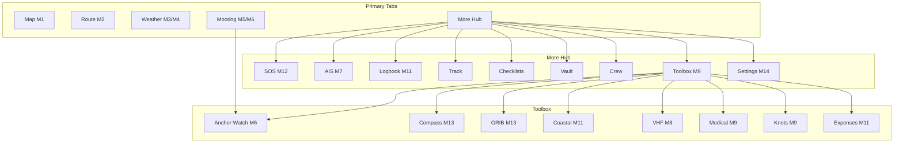

# Информационная архитектура Captain Wrongel

## 1. Иерархия (M1–M14 → UI)

```
Captain Wrongel
├── [Gate] Disclaimer (first run)
├── [Onboarding] 4 screens (step-08)
├── Shell (5 tabs)
│   ├── M1  Карта
│   ├── M2  Маршрут
│   ├── M3  Погода (+ M4 приливы inline)
│   ├── M5  Стоянки (+ M6 якорь)
│   └── More → хаб
│       ├── M12 SOS / Safety
│       ├── M7  AIS (step-20)
│       ├── M11 Logbook, Track, Expenses
│       ├── M9  Toolbox (M8 VHF, узлы, медицина, компас, GRIB, coastal)
│       ├── M10 Community (post-MVP)
│       └── M14 Settings
└── Modals / Sheets (глобальные)
    ├── Language picker
    ├── Map layers
    └── Emergency confirm
```

## 2. Sitemap



## 3. Навигационная система

| Решение | Выбор | Обоснование |
|---------|-------|-------------|
| Primary nav | Bottom `NavigationBar` / `NavigationRail` | Уже есть; one-hand |
| Max depth | 3 уровня | More → Toolbox → Knot detail |
| Quick actions | FAB на карте | Navionics pattern |
| Search | Top search на mooring, map | |
| Breadcrumbs | Tablet only | step-21 |

## 4. User Flows

### 4.1 Планирование маршрута
```
Map → long press → Add WP → Route tab → Edit WPs → 
Safety check (depth vs draft) → Save → Export GPX
```
Экраны: `map_screen`, `route_screen`, `advisory_disclaimer_gate`

### 4.2 Выход в море
```
Onboarding done → Weather tab (check wind) → 
Tides block → Route activate → Track start (More)
```

### 4.3 Поиск стоянки
```
Mooring tab → Map/List toggle → Filters → 
Card tap → Detail sheet → Navigate (deep link to Map)
```

### 4.4 Якорная стоянка
```
Mooring → Anchor Watch OR Toolbox → Anchor →
Set anchor point → Adjust radius → Arm alarm
```

### 4.5 Экстренная ситуация
```
More → SOS → Select type → Confirm → 
SMS/coords formatted → Timer starts
```

### 4.6 Проверка погоды
```
Weather tab → Timeline scrub → Layer switch → 
Tap hour → Detail card
```

### 4.7 AIS-наблюдение
```
More → AIS → Map with vessels → Tap ship → 
CPA/TCPA panel → Filter types
```

## 5. Приоритизация контента

| Зона экрана | Карта | Погода | Стоянка |
|-------------|-------|--------|---------|
| Primary | Chart + GPS puck | Timeline | Map pins |
| Secondary | Layer chips | Hour cards | List |
| Tertiary | Scale, coords | Model compare | Reviews |

## 6. Связи между модулями

| From | To | Trigger |
|------|-----|---------|
| Weather | Route | «Check route weather» chip |
| Mooring | Map | «Navigate here» |
| Route | Map | Show active polyline |
| AIS | Map | Shared vessel layer |
| Track | Map | Recording overlay |

## 7. Отличия от img.md (scope control)

Не выносить в отдельные top-level tabs (остаются в More/Toolbox):
- VHF, Knots, Medical — toolbox
- Community — post-MVP stub (step-28)
- AR navigation — post-MVP описание only
- WhatsApp/Telegram — OS-level, не in-app
