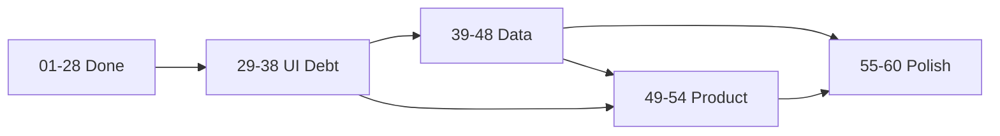

# Roadmap фаз G–J (шаги 29–60)

> Продолжение после завершённых шагов 01–28.  
> Базовый UI и design system готовы; фазы G–J закрывают **UI debt**, **данные**, **продукт** и **полировку img.md**.

## Обзор

| Фаза | Шаги | Цель | Оценка сессий |
|------|------|------|---------------|
| **G** UI Debt | 29–38 | Миграция вторичных экранов на `Cw*` | 10 |
| **H** Data & Maps | 39–48 | Подключить реальные данные к уже готовому UI | 10 |
| **I** Product | 49–54 | Модули IDEAS2 / HTML-макетов без Flutter | 6 |
| **J** Polish | 55–60 | i18n, a11y, perf, img.md артефакты | 6 |

**Итого:** 60 шагов · ~32 новых агент-сессии

## Зависимости между фазами

- **G** можно начинать сразу (требует только 01–07).
- **H** лучше после G на экранах compass/coastal/grib.
- **I** частично параллельна H (community не зависит от tiles).
- **J** — в конце или параллельно (i18n не блокирует H).

## Маппинг на модули IDEAS2 (M1–M14)

| Модуль | Шаги |
|--------|------|
| M1 Карта | 39–41, 48 |
| M2 Маршрут | (01–28 done) + 48 offline regions |
| M3 Погода | 47 wind on map |
| M4 Приливы | 42 live API |
| M5 Стоянки | 43 photos/ratings |
| M6 Якорь | 45 real map + SMS |
| M7 AIS | 46 NMEA, (20 done) |
| M8 VHF | (24 done) |
| M9 Справочники | 29–37 G-phase |
| M10 Community | 49 |
| M11 Яхта/журнал | 29–30, 37, 53 |
| M12 Безопасность | 50–51 |
| M13 GRIB/офлайн | 36, 44 |
| M14 Настройки | 55–56 i18n |

## Критерий «100% продукта»

После шагов 01–60 ожидается:
- Все экраны на design system
- Map layers меняют реальные тайлы
- Live tides + GRIB MVP
- Push-уведомления якорь/ветер
- Community + voyage monitoring stubs → MVP
- 9 языков, WCAG pass, error catalog

Не входит в 60 шагов (отдельный backlog):
- AR navigation, AI route optimizer, cloud sync, paywall billing SDK
- Сертифицированный ECDIS, лицензированные ENC
