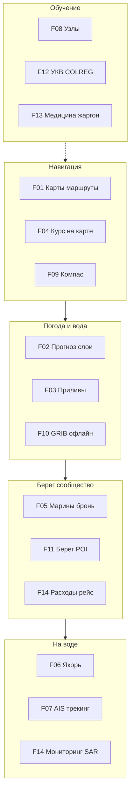
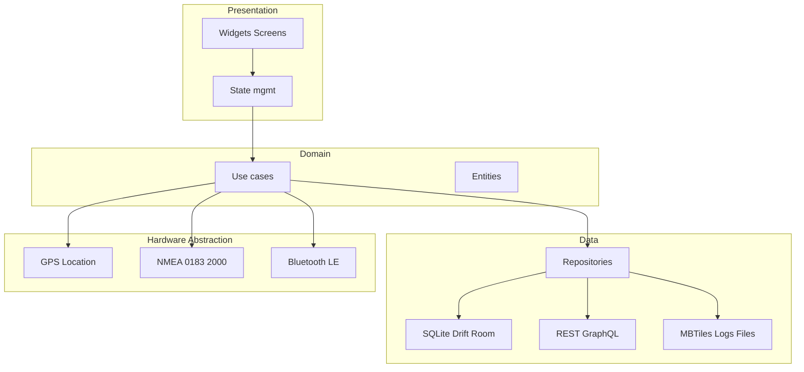

# Captain Wrongel — планирование разработки

Каталог связывает **пофазовую поставку** приложения Captain Wrongel, продуктовую спецификацию [`../TODO.md`](../TODO.md) и разобранный по темам обзор референс-приложений [`../IDEAS.md`](../IDEAS.md) (в т.ч. расширенный блок: метео-помощники, навигация, якорь, трекеры, УКВ-тренажёры, справочники, топ-списки).

**Техническая основа для кодирования** (C4, SQLite/Drift, карты, LLM, тесты >90 %, HTML-макеты UI): [`../Подробный план реализации.md`](../Подробный%20план%20реализации.md).

**Структурированные вводные IDEAS2** (дедупликация модулей, M1–M14, переосмысление scope): [`IDEAS2-structured.md`](IDEAS2-structured.md) · макеты: [`../docs/ui/`](../docs/ui/).

## Принципы

- **Offline-first:** карты, журнал, GRIB/кэш погоды и приливов — локально; облако и глобальный AIS только осознанно.
- **Gate между фазами:** следующая фаза после выполнения критериев текущей.
- **Юридика:** не ECDIS; карты и AIS по лицензиям поставщиков; любая передача координат берегу — с согласием ([F14](features/F14-voyage-monitoring-expenses.md)).
- **Честность данных:** глубины и береговая линия могут быть ошибочны; «трек по суше» — известный класс проблем массовых карт.

## Как читать IDEAS.md после расширения

Текст IDEAS разбит на тематические группы — каждая сведена к одному или нескольким файлам в **[features/](features/)**:

| Тема в IDEAS | Примеры названий | Фичи-планы |
|----------------|------------------|------------|
| Метеопрогнозы и слои | Windy, Windfinder, Clime, Weather radar, WindCompass, Windy.app (сообщества), PocketGrib | [F02](features/F02-weather-forecast-animation.md), [F10](features/F10-offline-grib.md); соц. споты → [F05](features/F05-marinas-anchorages-booking.md) / Фаза 6 |
| Приливы и астрономия | Tides Planner, Tide Guide, Tide Times | [F03](features/F03-tides-astronomy.md) |
| Навигация и чартплоттер | Navionics, iNavX, iSailor, C-map / Plan2Nav | [F01](features/F01-maritime-charts-routes-sync.md), [F04](features/F04-map-orientation-pilot.md) |
| Марины, якорь, берег | Navily, MySea, Marinatips; Anchor/Zenkou | [F05](features/F05-marinas-anchorages-booking.md), [F06](features/F06-anchor-watch-alarm.md), [F11](features/F11-coastal-guide-shore-poi.md) |
| Трекеры судов | Marine Traffic, Find Ship, VesselFinder, Cruise Mapper, MyShipTracking | [F07](features/F07-vessel-tracking-ais.md) |
| УКВ и COLREG | VHF talk/trainer, Maritime VHF Operator, COLREG 72 trainer | [F12](features/F12-maritime-training-radio-colreg.md) |
| Справочники | Knot Guide / узлы, Первая помощь, 7ft, cMate-lite | [F08](features/F08-knot-reference.md), [F13](features/F13-medical-glossary-reference.md) |
| Безопасность и быт | SafeTrx, SailGrib WR (расходы), топ-списки IDEAS | [F14](features/F14-voyage-monitoring-expenses.md), Фаза 7 |

Полный индекс файлов: **[features/README.md](features/README.md)** (F01–F14).

## Карта возможностей (обзор)

## Архитектура (ориентир)

Слоистая модель: Presentation → Domain → Data → Hardware Abstraction (GPS, NMEA, Bluetooth).

**Стек (Фаза 0):** Flutter или React Native + MapLibre GL / Mapbox GL + SQLite; нативные модули для NMEA/BLE и при необходимости GRIB.

**Секреты:** ключи API не в репозитории (`--dart-define`, CI secrets).

## Оглавление фаз (время поставки)

Источник правды по задачам фазы и **полному чек-листу перехода** — соответствующий файл `phase-NN-*.md` (раздел «Чек-лист перехода…» или «Чек-лист готовности…» для Фазы 0). Колонка **Кратко** здесь совпадает по смыслу с теми чек-листами и критериями приёмки.

| Фаза | Файл | Кратко |
|------|------|--------|
| 0 | [phase-00-bootstrap.md](phase-00-bootstrap.md) | Репозиторий, scope MVP; CI с **`flutter test --coverage`**; тема и i18n RU/EN; **`AppLogger`**, **`AuditRepository`**, миграция **`user_action_audit`** |
| 1 | [phase-01-navigation-core.md](phase-01-navigation-core.md) | Карта MapLibre, GPS, офлайн-регион, черновой маршрут, дисклеймер; ключевые действия в **`user_action_audit`**; порог покрытия домена навигации и репозиториев (CI) |
| 2 | [phase-02-bathymetry-layers.md](phase-02-bathymetry-layers.md) | Изобаты, буи, слои, long-press; легальный источник для региона MVP; graceful degradation без слоя в кэше; **аудит** видимости слоёв |
| 3 | [phase-03-ais-nmea.md](phase-03-ais-nmea.md) | NMEA/AIS абстракция (mock и реальный поток через один интерфейс), CPA/TCPA, цели на карте; **эталонные тесты** парсера и CPA/TCPA (финальный план §9.3); документация про внешний AIS-приёмник |
| 4 | [phase-04-weather-tides.md](phase-04-weather-tides.md) | Погода и приливы с офлайн-кэшем, оверлей на карте; единицы измерения в настройках; **TTL / stale-while-revalidate покрыты тестами**; ошибки API не ломают карту; последний прогноз офлайн до истечения TTL |
| 5 | [phase-05-auto-guidance.md](phase-05-auto-guidance.md) | Auto Guidance v1 по глубинам (advisory): сетка, осадка, запретные зоны; осадка и пересчёт; дисклеймер до первого расчёта; **порог CI для `packages/domain`** |
| 6 | [phase-06-marinas-community.md](phase-06-marinas-community.md) | Марины, якорные, отзывы (офлайн-очередь), Crew Match по приоритету; **GDPR** задокументирован; **`user_action_audit`** без лишних персональных данных в payload |
| 7 | [phase-07-safety-logbook.md](phase-07-safety-logbook.md) | Журнал, SOS, треки, чек-листы, документы, роли экипажа; юр. текст SOS/документов; **SOS и роли** — тесты и аудит по финальному плану §10.2 и Приложению A |
| 8 | [phase-08-polish.md](phase-08-polish.md) | Перчатки, контраст, энергия GPS/карты, планшеты/split-view, локали после RU/EN; **CI — пороги покрытия финального плана**; аудит безопасности и ключевых действий (**Приложение A**) проверены (**MVP+**) |

### Сводка критериев перехода (как в чек-листах фаз)

Ниже — только «якорные» пункты из чек-листов; детали и таблицы шагов остаются в файлах фаз.

| Переход | Обязательные элементы gate |
|---------|-------------------------------|
| **0 → 1** | Выбран и описан фреймворк; CI зелёный (включая coverage gate); тема и базовые строки локализации; инфраструктура **аудита** и технического логирования по финальному плану |
| **1 → 2** | Карта и GPS стабильны на целевых устройствах; офлайн-проверка одного региона; ключевые действия по карте и маршруту в **`user_action_audit`**; покрытие домена навигации по порогу CI |
| **2 → 3** | Юридически допустимый источник данных для MVP-региона; нет падений при отсутствии слоя в кэше; изменения видимости слоёв отражаются в аудите там, где нужно для расследований |
| **3 → 4** | Mock и реальный поток через один интерфейс; пользовательская документация про внешний AIS-приёмник; CPA/TCPA и парсер покрыты эталонными тестами |
| **4 → 5** | Единые единицы измерения через настройки; TTL/stale для погоды и приливов покрыты тестами; ошибки API не ломают карту; офлайн — последний успешный прогноз до истечения TTL |
| **5 → 6** | Осадка и пересчёт маршрута; дисклеймер advisory routing до первого использования; доменная логика Auto Guidance покрыта тестами по порогу CI для **`packages/domain`** |
| **6 → 7** | Политика GDPR для отзывов и Crew Match; ключевые действия сообщества в аудите без лишнего PII в payload |
| **7 → 8** | Юридические тексты для SOS и хранения документов; SOS и роли покрыты тестами и аудитом §10.2 и Приложения A |
| **После 8 (MVP+)** | **`flutter test --coverage`** зелёный при порогах финального плана; цепочка аудита для безопасности и ключевых действий из Приложения A проверена на тестовых сценариях |

## Сводка: фича → фаза

| Фича | Основные фазы |
|------|----------------|
| F01 | 1, 2, 5, 6 |
| F02 | 4 |
| F03 | 4 |
| F04 | 1, 4 |
| F05 | 6, 7 |
| F06 | 1, 7, 8 |
| F07 | 3 (+ облако опционально) |
| F08 | 0+ контент |
| F09 | 1, 8 |
| F10 | 4 |
| F11 | 6 |
| F12 | 0+ образование |
| F13 | 0+ справочники |
| F14 | 7 |

## Сквозное тестирование

- **Юнит:** NMEA/AIS, CPA/TCPA, маршрутизация, GRIB-декод (если включён), конфликты синхронизации.
- **Интеграция:** SQLite, тайлы, восстановление после сбоя, импорт файлов GRIB.
- **E2E:** офлайн-карта, SOS тестовый режим, якорная тревога с симуляцией координат.
- **Полевые:** солнце, вибрация, влага, холод — `TODO.md`.
- **Энергия:** длительный рейс и ночная якорная вахта.

## Глобальные риски

| Риск | Митигация |
|------|-----------|
| Лицензии ENC / карт / AIS | Юр. проверка; прод только по договору |
| Перегруз функций IDEAS | Gate фаз; образование и GRIB — отдельные модули |
| SOS и мониторинг берега | Регламенты регионов; явное согласие; отделение от учебных тренажёров ([F12](features/F12-maritime-training-radio-colreg.md)) |
| Якорный GPS | Гистерезис; обучение пользователя |
