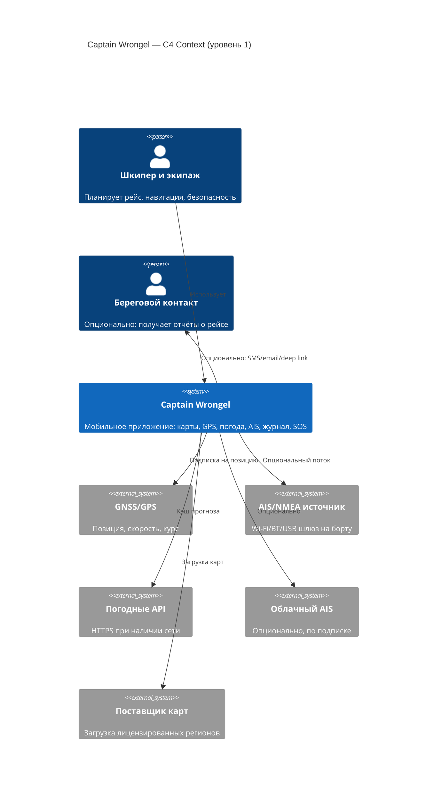
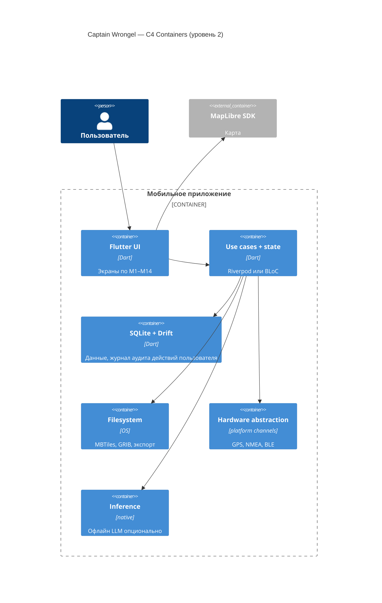
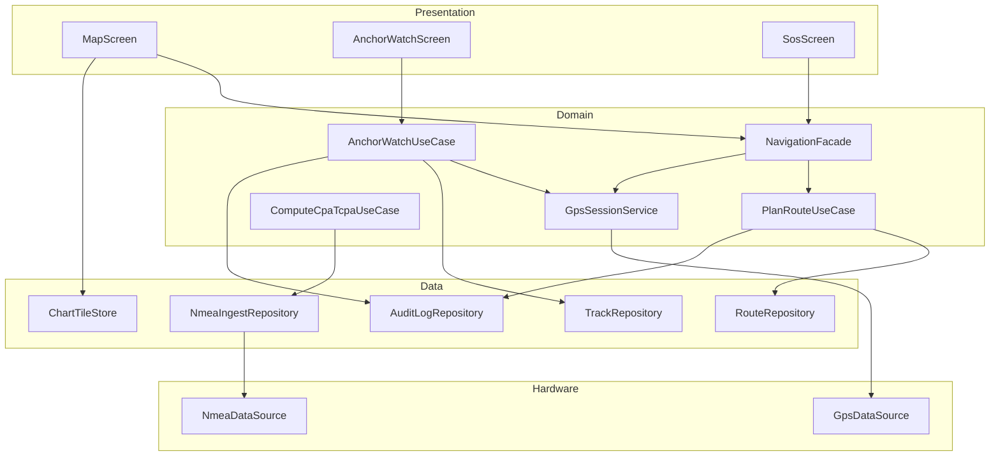
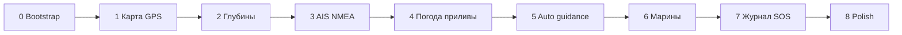

# Captain Wrongel — финальный план реализации (живой документ)

**Версия:** 2.0 (финальная структура: `TODO.md`, `IDEAS.md`, `IDEAS2.md` → [`plan/IDEAS2-structured.md`](plan/IDEAS2-structured.md), фазы `plan/phase-*.md`, фичи `plan/features/`, UI [`docs/ui/`](docs/ui/)).

**Обязательные дисциплины:** **TDD** (сначала тест, потом код), **покрытие ≥90%** `lib/domain` + `lib/data` (см. §9), **обязательное структурное логирование** всех значимых действий (§8), **комментирование и `dartdoc`** для публичных API (§10).

---

## Оглавление

1. [Цели продукта и MVP](#1-цели-продукта-и-mvp)  
2. [Диаграммы C4](#2-диаграммы-c4)  
3. [Модули M1–M14 и дерево пакетов](#3-модули-m1m14-и-дерево-пакетов-flutter)  
4. [Классы и интерфейсы по слоям](#4-классы-и-интерфейсы-по-слоям-примерная-карта)  
5. [Структуры данных и БД Drift](#5-структуры-данных-и-бд-drift)  
6. [Внешние API и контракты](#6-внешние-api-и-контракты)  
7. [Протоколы на борту](#7-протоколы-на-борту-nmea-signal-k)  
8. [Кеши](#8-кеши-слои-и-политики)  
9. [TDD и покрытие](#9-tdd--обязательное-покрытие-тестами)  
10. [Логирование и аудит](#10-логирование-и-аудит-обязательно)  
11. [Стандарты комментирования и примеры](#11-стандарты-комментирования-кода)  
12. [UI / HTML-макеты](#12-ui--html-макеты)  
13. [Roadmap по фазам](#13-roadmap-синхронизация-с-plan)  
14. [Следующие шаги команды](#14-следующие-шаги-команды)

---

## 1. Цели продукта и MVP

### 1.1 Позиционирование

Один **offline-first** мобильный навигатор для яхты: карты + метео + безопасность якоря + AIS + журнал и учёт + обучение + сообщество по мере готовности — без попытки «склонировать тысячу функций», с упором на **надёжность**, **ясность на палубе**, **прозрачность данных**.

### 1.2 MVP (минимально жизнеспособный продукт — IDEAS2 + фазы)

| Порядок | Модуль | Результат |
|---------|--------|-----------|
| 1 | **Карты и GPS** — офлайн регион, положение, черновой маршрут | Фазы 0–1 |
| 2 | **Погода** — горизонт ≥3 дня, быстрый слой ветра (упрощённый Windy-like) | Фаза 4 |
| 3 | **Якорная вахта** — радиус/контур, фон, тревога | Фазы 1 + 7 + полировка энергии |

Остальное M4–M14 — **feature flags**, подписка или следующие эпики.

### 1.3 Модули приложения M1–M14 (канон IDEAS2)

См. полную таблицу: [`plan/IDEAS2-structured.md`](plan/IDEAS2-structured.md). Здесь — связь только имён:

| UI (нижний док + Ещё) | Модули |
|------------------------|--------|
| Карта | M1 |
| Маршрут | M2 |
| Погода (+ приливы `#tides`) | M3, M4 |
| Стоянка | M5, M6 (якорь отдельным экраном) |
| Ещё | M7–M14 |

---

## 2. Диаграммы C4

### 2.1 Уровень 1 — System Context



Критическая граница: **ядро безопасности работает без облака.**

### 2.2 Уровень 2 — Containers



### 2.3 Уровень 3 — Компоненты навигации и безопасности



### 2.4 Границы модулей M1–M14 (логическая схема)

```mermaid
flowchart LR
  subgraph core [Core]
    M1[M1 Карта]
    M2[M2 Маршрут]
  end
  subgraph env [Среда]
    M3[M3 Погода]
    M4[M4 Приливы]
  end
  subgraph shore [Берег]
    M5[M5 Стоянка]
    M6[M6 Якорь]
  end
  subgraph traffic [Трафик]
    M7[M7 AIS]
  end
  subgraph knowledge [Знания]
    M8[M8 УКВ]
    M9[M9 Обучение]
  end
  subgraph social [Люди]
    M10[M10 Сообщество]
  end
  subgraph ops [Эксплуатация]
    M11[M11 Журнал]
    M12[M12 ЧС]
    M13[M13 Офлайн инстр]
    M14[M14 Настройки]
  end
  core --> env
  env --> shore
  shore --> traffic
  traffic --> knowledge
  knowledge --> social
  social --> ops
```



### 2.5 Фазы поставки



---

## 3. Модули M1–M14 и дерево пакетов Flutter

Рекомендуемая структура каталога `lib/`:

```
lib/
  main.dart
  app.dart
  core/
    config/                 # FeatureFlags, AppConfig
    logging/                # AppLogger, AuditSink
    errors/                 # Failure, Result
    di/                     # providers / injection
  domain/                   # БЕЗ зависимостей от Flutter
    navigation/
    routing/
    weather/
    tides/
    anchor/
    ais/
    safety/
    voyage/
    ...
  data/
    local/                  # Drift DB, DAOs
    remote/                 # HTTP clients
    repositories/
    nmea/
    mbtiles/
  features/
    map/
    route_planner/
    weather/
    mooring/
    anchor_watch/
    ais/
    community/
    learn/
    radio_trainer/
    yacht_log/
    safety/
    tools_offline/
    assistant_llm/
    settings/
  hardware/
    gps/
    bluetooth/
    nmea_socket/
```

Правило: **`domain/` и `data/repositories` покрываются тестами первыми** (TDD).

---

## 4. Классы и интерфейсы по слоям (примерная карта)

Ниже — ориентир для реализации; имена можно уточнить в ADR.

### 4.1 Domain (чистый Dart)

| Область | Абстракции | Назначение |
|---------|------------|------------|
| Навигация | `ChartRegion`, `LatLon`, `CourseSpeed` | Модели |
| | `RoutePlan`, `Waypoint` | Маршрут |
| | `PlanRouteUseCase`, `MeasureDistanceUseCase` | Сценарии |
| Погода | `WeatherBundle`, `ModelId` enum | Агрегат прогноза |
| | `FetchWeatherUseCase` | Кэш + API |
| Приливы | `TideStation`, `TideExtreme` | HW/LW |
| Якорь | `AnchorZone` (circle | polygon), `AnchorState` | Политика тревоги |
| | `EvaluateAnchorDriftUseCase` | Гистерезис, loss of GPS |
| AIS | `VesselTarget`, `CpaTcpaResult` | Расчёт |
| | `ParseNmeaUseCase`, `Stream<AisSentence>` | Вход |
| Журнал | `LogbookEntry`, `ExpenseEntry` | Учёт |
| Безопасность | `DistressCoordinator` | SOS оркестрация |
| Аудит | `AuditAction` sealed class | Типы событий для лога |

### 4.2 Data

| Класс | Роль |
|-------|------|
| `*RepositoryImpl` | Реализация контрактов из domain |
| `WeatherApiClient` | HTTP + retry + маппинг JSON → entity |
| `DriftDatabase` | Единая БД + миграции |
| `NmeaTcpDataSource` | Приём байт с шлюза |
| `MbtilesReader` | Read-only доступ к тайлам |

### 4.3 Presentation

| Паттерн | Пример |
|---------|--------|
| `*Screen`, `*Widget` | UI |
| `*Notifier` / `*Cubit` | Состояние экрана |
| `NavigationShell` | Нижний док: Карта / Маршрут / Погода / Стоянка / Ещё |

---

## 5. Структуры данных и БД Drift

### 5.1 Принципы

- Одна БД приложения (`app.db`), версия схемы только через **Drift migrations** + **тест от v(n) к v(n+1)**.
- Таблица **`user_action_audit`** обязательна для значимых действий (см. §8).
- PII минимизация: в аудит не писать точные координаты без настройки «расширенный лог» (debug).

### 5.2 Таблицы (логический DDL)

```sql
-- Маршруты
CREATE TABLE routes (
  id TEXT PRIMARY KEY,
  name TEXT NOT NULL,
  created_at INTEGER NOT NULL,
  updated_at INTEGER NOT NULL,
  version INTEGER NOT NULL DEFAULT 1
);
CREATE TABLE route_waypoints (
  id TEXT PRIMARY KEY,
  route_id TEXT NOT NULL REFERENCES routes(id),
  seq INTEGER NOT NULL,
  lat REAL NOT NULL,
  lon REAL NOT NULL,
  name TEXT
);

-- Трек
CREATE TABLE track_points (
  id INTEGER PRIMARY KEY AUTOINCREMENT,
  trip_id TEXT NOT NULL,
  t INTEGER NOT NULL,
  lat REAL NOT NULL,
  lon REAL NOT NULL,
  sog REAL,
  cog REAL
);

-- Журнал
CREATE TABLE logbook_entries (
  id TEXT PRIMARY KEY,
  t INTEGER NOT NULL,
  category TEXT NOT NULL,
  payload_json TEXT NOT NULL
);

-- Расходы / ТО — отдельные таблицы или JSON в категории (ревью при росте)

-- Кэш погоды
CREATE TABLE weather_cache (
  key TEXT PRIMARY KEY,        -- хэш bbox+модель+версия схемы
  fetched_at INTEGER NOT NULL,
  expires_at INTEGER NOT NULL,
  body BLOB NOT NULL           -- сжатый JSON или protobuf
);

-- Приливы
CREATE TABLE tide_cache (
  station_id TEXT NOT NULL,
  day INTEGER NOT NULL,        -- UTC day key
  body BLOB NOT NULL,
  expires_at INTEGER NOT NULL,
  PRIMARY KEY (station_id, day)
);

-- Карты
CREATE TABLE chart_regions (
  region_id TEXT PRIMARY KEY,
  path TEXT NOT NULL,
  checksum TEXT,
  installed_at INTEGER NOT NULL,
  license_tier TEXT NOT NULL
);

-- Настройки ключ-значение
CREATE TABLE settings_kv (
  k TEXT PRIMARY KEY,
  v TEXT NOT NULL
);

-- Очередь синхронизации (если аккаунт)
CREATE TABLE sync_outbox (
  id INTEGER PRIMARY KEY AUTOINCREMENT,
  entity TEXT NOT NULL,
  payload_json TEXT NOT NULL,
  created_at INTEGER NOT NULL,
  attempt_count INTEGER NOT NULL DEFAULT 0
);

-- Аудит действий пользователя (обязательный минимум)
CREATE TABLE user_action_audit (
  id INTEGER PRIMARY KEY AUTOINCREMENT,
  t INTEGER NOT NULL,
  session_id TEXT NOT NULL,
  module TEXT NOT NULL,       -- M1..M14 или core
  action TEXT NOT NULL,       -- enum строкой: route_save, anchor_arm, sos_test...
  severity TEXT NOT NULL DEFAULT 'info', -- info|warning|critical
  context_json TEXT           -- без PII по умолчанию
);
```

### 5.3 Файловое хранилище (не SQL)

| Путь (пример) | Содержимое |
|----------------|------------|
| `{appDocuments}/charts/{regionId}.mbtiles` | Карты |
| `{appDocuments}/grib/` | Импортированные GRIB |
| `{appDocuments}/exports/` | GPX, CSV экспорты |
| `{cache}/tiles/` | LRU HTTP тайлов |
| `{appDocuments}/vault/` | Зашифрованные PDF (документы судна) |

---

## 6. Внешние API и контракты

Все вызовы только через **`data/remote`** + **кэш в Drift** + **логирование результата (успех/ошибка/латентность)** без тела ответа в прод-логах.

### 6.1 Метео (пример Open-Meteo)

| Поле | Описание |
|------|----------|
| Endpoint | `https://api.open-meteo.com/v1/forecast` |
| Параметры | `latitude`, `longitude`, `hourly=wind_speed_10m,...`, `models` |
| Кэш-ключ | округлённые 3 знака lat/lon + модель + горизонт часов |

**Минимальная форма ответа (фрагмент JSON):**

```json
{
  "hourly": {
    "time": ["2026-04-22T00:00", "..."],
    "wind_speed_10m": [5.2, 6.1]
  }
}
```

### 6.2 Приливы (провайдер выбирается ADR по региону)

Пример формы: `station_id`, массив пар `(t, height_m)`, `datum`. Кэш по `(station_id, utc_day)`.

### 6.3 Облачный AIS (опционально)

REST/ WebSocket по договору с поставщиком; **всегда** `Authorization: Bearer` из secure storage; **никогда** логировать токен.

### 6.4 Загрузка карт

HTTPS **Range** для MBTiles или отдельный manifest JSON: `region_id`, `sha256`, `size`, `url`.

---

## 7. Протоколы на борту (NMEA, Signal K)

### 7.1 NMEA 0183

- Транспорт: **TCP/UDP** к шлюзу (типично UDP 2000 или настраиваемый порт), реже **serial** через USB-OTG / Bluetooth.
- Поток: строки ASCII, разделитель `$` / `!`, контрольная сумма `*HH`.
- Минимальные предложения для AIS: `!AIVDM`, `!AIVDO`; для GNSS: `RMC`, `GGA`, `VTG`.

**Тестирование:** только через **фикстуры файлов** + золотой эталон распарсенных структур.

### 7.2 Signal K (опционально, post-MVP)

- JSON по **WebSocket** `signalk://` или TCP; путь вида `navigation.position`, `navigation.courseOverGroundTrue`.
- Абстракция в коде: `SignalKDelta` → внутренние `NavigationFix`.

---

## 8. Кеши: слои и политики

| Слой | Что | Политика инвалидации |
|------|-----|----------------------|
| L1 | In-memory (Riverpod cache) | TTL 1–5 мин для метео точки |
| L2 | Drift `weather_cache`, `tide_cache` | `expires_at`; фоновое обновление при сети |
| L3 | Файлы MBTiles / GRIB | Пока пользователь не удалит регион |
| L4 | HTTP tile cache dir | LRU по размеру (настройка) |

**Правило:** любой промах кэша → явный UX «данные устарели» + время последнего успеха.

---

## 9. TDD — обязательное покрытие тестами

### 9.1 Дисциплина разработки

1. **Red:** написать падающий тест в `test/domain/...` или `test/data/...`.
2. **Green:** минимальный код для прохождения.
3. **Refactor:** без изменения поведения; тесты зелёные.

Для каждой новой **use case** порядок файлов:

1. `*_test.dart` — кейсы граничные + нормальные.
2. `*_use_case.dart` — реализация.
3. Подключение к репозиторию и UI.

### 9.2 Пример цикла TDD (псевдокод)

**Тест (сначала):**

```dart
// test/domain/anchor/evaluate_anchor_drift_test.dart
void main() {
  test('alarms when distance exceeds radius with hysteresis', () {
    final zone = AnchorZone.circle(lat: 0, lon: 0, radiusM: 50);
    final uc = EvaluateAnchorDriftUseCase(hysteresisM: 5);
    expect(uc.status(zone, fix(lat: 0.0005, lon: 0)), AnchorAlarmState.ok);
    expect(uc.status(zone, fix(lat: 0.01, lon: 0)), AnchorAlarmState.alarm);
  });
}
```

**Код (потом):** минимальная реализация `EvaluateAnchorDriftUseCase`.

### 9.3 Пороги качества

| Область | Покрытие строк |
|---------|----------------|
| `lib/domain/**` | **≥ 90%** |
| `lib/data/repositories/**` | **≥ 90%** |
| Критические алгоритмы (CPA/TCPA, NMEA checksum, anchor hysteresis, миграции) | **100% веток** |

Исключения в CI только списоком в `coverage_exclusions.yaml` (генерация Drift, `main.dart`).

### 9.4 Виды тестов

- Unit — домен, парсеры.
- Integration — Drift in-memory + репозиторий.
- Fixture replay — NMEA логи из `test/fixtures/nmea/*.log`.
- Widget — ключевые кнопки SOS/якорь (после стабилизации).

---

## 10. Логирование и аудит (обязательно)

### 10.1 Два канала

| Канал | Назначение | Хранение |
|-------|------------|----------|
| **Технический лог** | Отладка, производительность, ошибки сети | Консоль / файлы ротации **только debug**; в релиз — усечённые сообщения |
| **Аудит действий пользователя** | Безопасность, расследование инцидентов | Таблица `user_action_audit` + опциональный экспорт |

### 10.2 Что логировать обязательно (минимум)

- Старт/стоп якорной вахты; изменение параметров зоны.
- Сохранение/удаление маршрута; экспорт GPX.
- Изменение настроек судна (осадка, единицы).
- Любое нажатие **SOS** (включая тестовый режим — с флагом).
- Подключение/отключение NMEA источника.
- Ошибки получения GPS > N секунд (агрегированно, без каждой точки).

### 10.3 Чего не логировать в проде

- Полные координаты в аудите **без явного согласия**.
- Токены API, MMSI других судов в открытом виде.

### 10.4 Формат технического лога (пример)

```json
{"ts":"2026-04-22T12:00:00Z","level":"INFO","tag":"WeatherRepo","msg":"cache_hit","attrs":{"key":"wx:59.94:30.32:gfs"}}
```

---

## 11. Стандарты комментирования кода

### 11.1 Публичные API — `dartdoc`

Каждый публичный класс и метод в `domain/` и публичные репозитории:

```dart
/// Вычисляет статус якорной тревоги с гистерезисом по радиусу.
///
/// [zone] — допустимая область относительно точки закладки якоря.
/// [fix] — текущая оценка позиции (WGS84).
///
/// Возвращает [AnchorAlarmState.alarm], если расстояние превышает
/// радиус минус [hysteresisM] после предыдущего состояния тревоги — см. ТЗ §якорь.
AnchorAlarmState evaluate(AnchorZone zone, GeoFix fix);
```

### 11.2 Нефункциональные инварианты в коде

```dart
// INVARIANT: CPA вычисляется в UTC; скорости в м/с внутри, узлы только на границе UI.
```

### 11.3 Ссылки на ТЗ

В сложных местах: `// TZ: Подробный план реализации.md §7 NMEA`

---

## 12. UI / HTML-макеты

Обновлённая структура IDEAS2: нижний док из **пяти** пунктов + хаб «Ещё».

| Экран | Файл |
|-------|------|
| Карта | [`docs/ui/map.html`](docs/ui/map.html) |
| Маршрут | [`docs/ui/route.html`](docs/ui/route.html) |
| Погода (+ `#tides`) | [`docs/ui/weather.html`](docs/ui/weather.html) |
| Стоянка | [`docs/ui/mooring.html`](docs/ui/mooring.html) |
| Ещё (все модули M7–M14) | [`docs/ui/more.html`](docs/ui/more.html) |

Полный список и запуск сервера: [`docs/ui/README.md`](docs/ui/README.md).

---

## 13. Roadmap (синхронизация с `plan/`)

| Фаза | Файл | Содержание |
|------|------|------------|
| 0 | [`plan/phase-00-bootstrap.md`](plan/phase-00-bootstrap.md) | Репозиторий, CI, **coverage gate**, тема |
| 1–8 | `plan/phase-01..08` | Как ранее |
| Фичи | [`plan/features/`](plan/features/) | F01–F14 |

Зависимость модулей IDEAS2 от фаз: ядро M1–M3 MVP → M4–M14 по очереди приоритизации.

---

## 14. Следующие шаги команды

1. Зафиксировать ADR: Flutter + Drift + MapLibre + Riverpod (или BLoC) + структура пакетов §3.
2. Включить в CI: `dart test --coverage`, проверка порога, **тесты миграций Drift**.
3. Реализовать **`AppLogger` + `AuditRepository`** до первого пользовательского экрана после дисклеймера.
4. Вести каждую фичу строго по **TDD §9**.
5. Пройти HTML-макеты [`docs/ui/`](docs/ui/) и закрепить навигацию в Flutter `NavigationShell`.

---

## Приложение A — трассировка функционал → артефакты

| Функционал | Модуль | БД / файлы | Тесты | Лог аудита |
|------------|--------|------------|-------|------------|
| Карта | M1 | `chart_regions`, MBTiles | Tile manifest | `chart_region_mount` |
| Маршрут | M2 | `routes`, `route_waypoints` | Unit дистанция | `route_save`, `route_delete` |
| Погода | M3 | `weather_cache` | Mock HTTP | `weather_fetch` |
| Приливы | M4 | `tide_cache` | Эталон HW/LW | `tide_fetch` |
| Якорь | M6 | settings + runtime | Гистерезис 100% | `anchor_arm`, `anchor_alarm` |
| AIS | M7 | опц. targets | NMEA fixtures | `nmea_connect` |
| SOS | M12 | — | E2E тест режим | `sos_*` critical |

---

*Документ обновляется при смене схемы БД, контрактов API или набора модулей M1–M14.*
